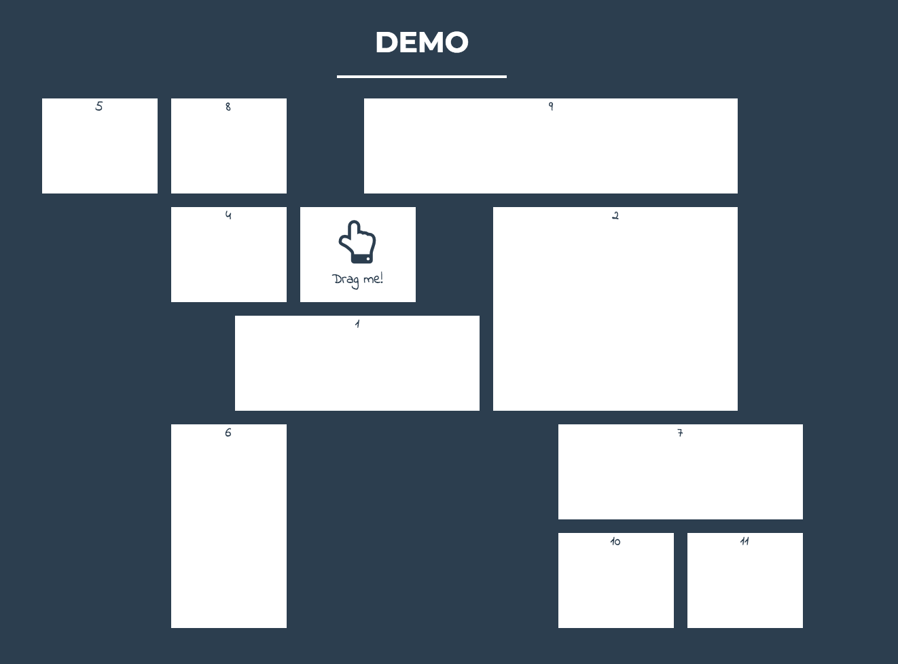

# design-resources
## UI
* [Go JS - planogram](https://gojs.net/latest/samples/planogram.html)

    
    
* [Packery](https://packery.metafizzy.co/) (draggable grid layouts)

    
    
* [Grid JS](http://gridstackjs.com/)

    
    
* [Rebass Cards](https://rebassjs.org/Card)

    
    
* [Masonry](https://masonry.desandro.com/) (cards layout)

    
        
* [Material UI](https://material-ui.com/) (Google's material design)

    
    
* [Freebies Gallery](http://www.freebiesgallery.com)

    

    
## Palette
